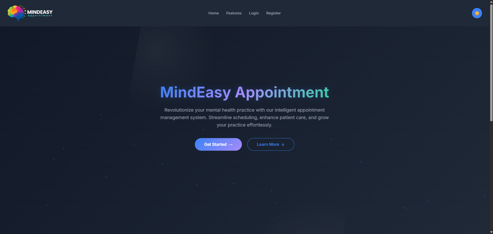
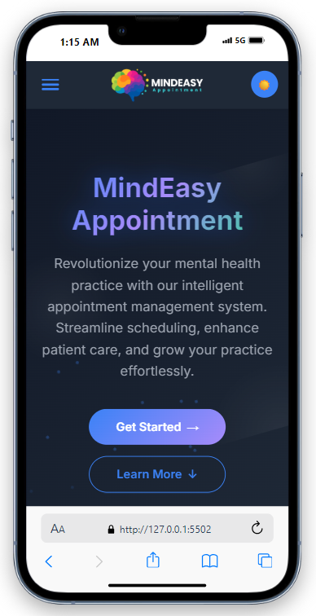

# 🧠 MindEasy - Mental Health Practice Management

A modern, responsive web application designed for mental health professionals to manage appointments, patients, and their practice efficiently.

👉 [Check it out here](https://nandabri.github.io/MindEasy/)

---

## 💡 About the Project

This project was built using **HTML5**, **CSS3**, and **JavaScript**.
I focused on creating a professional, accessible, and user-friendly interface for healthcare providers.

---

##  Features

- 📱 **Responsive design** — adapts to all screen sizes (mobile, tablet, desktop)
- 🎨 **Modern & clean UI** — professional interface with smooth animations
- � **Dark/Light mode toggle** — automatic theme switching with preference saving
- 📊 **Dashboard** — real-time statistics and appointment management
- 🔐 **Authentication system** — login, registration, and password recovery
- � **Appointment management** — today's schedule with quick actions
- 👥 **Patient overview** — recent patients and profile management
- 💰 **Revenue tracking** — monthly financial insights
- 🎯 **Interactive components** — hover effects and form validation

---

##  Technologies Used

- **HTML5** — semantic markup and modern web standards
- **CSS3** — custom styles, Grid/Flexbox layouts, and animations
- **JavaScript** — ES6+ features, local storage, and form validation
- **Google Fonts** — Inter font family for modern typography

---

##  Preview

### Desktop View

### Mobile View

---

## 🔧 Quick Start

1. **Clone or Download** the repository
2. **Open** any HTML file in your web browser
3. **No build process required** — it's a static website
4. **Enjoy** the MindEasy experience!

---

##  Color Palette

### Light Theme
- **Primary**: #2563eb (Blue)
- **Success**: #10b981 (Green)
- **Background**: #f8fafc (Light Gray)

### Dark Theme
- **Primary**: #3b82f6 (Lighter Blue)
- **Success**: #34d399 (Lighter Green)
- **Background**: #111827 (Dark)

---

## 🔮 Future Enhancements

- [ ] Backend integration with user authentication API
- [ ] Real-time appointment notifications
- [ ] Patient communication system
- [ ] Advanced reporting and analytics
- [ ] Progressive Web App (PWA) functionality

---

## 🤝 Contributing

We welcome contributions! Please feel free to submit a Pull Request.

---

## ⚖️ License

This project is open for learning purposes. Feel free to get inspired, but don't copy.

**Made with ❤️ for mental health professionals by Fernanda Belmont**

**Thank you for visiting MindEasy! ✨**
